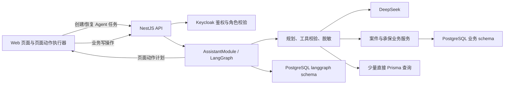
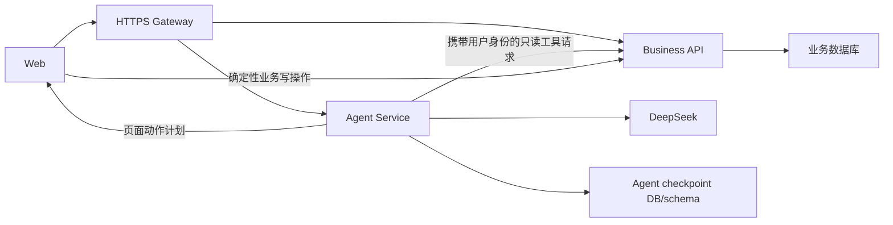

# Agent 是否拆成独立服务：评估结论

## 结论

**当前不拆。** 继续让 Agent 作为 NestJS API 内的独立模块运行，但从现在开始按“可拆边界”约束新增代码。

目前拆分带来的网络、鉴权、审计、部署和故障处理成本，大于独立扩缩容收益。Agent 的主要耗时来自外部模型等待，不是本机 CPU；页面动作又必须回到浏览器执行，单独增加一个容器并不能消除这段交互链路。当前也没有并发量、API 延迟或发布节奏方面的数据证明必须拆分。

## 当前结构

当前已经具备适合继续模块化的基础：

- Agent 只有 `/api/assistant/*` 入口，控制器边界明确；
- LangGraph 任务使用稳定 `taskId`，支持中断、恢复和取消；
- 页面动作通过注册 ID 执行，不依赖 DOM 自动化；
- Keycloak 角色、操作审计、外发脱敏和幂等机制已经存在；
- checkpoint 使用独立 `langgraph` schema。

尚不适合直接拆分的耦合点：

- `plan-service.ts` 直接调用承保和案件 Prisma Service；
- `backend-tools.ts` 直接访问 Prisma，并复用业务状态机；
- Agent 返回的是浏览器页面动作，任务完成依赖 Web 回传执行结果；
- 用户身份、角色和审计上下文目前天然继承同一 NestJS 请求；
- checkpoint 与业务库使用同一数据库连接和生命周期；
- 尚未建立 Agent 单独的吞吐量、失败率、模型耗时和任务积压监控。

## 如果现在强行拆分，会新增什么

拆分后 Agent 不应直接连接业务表，也不应复制案件状态机。它只能调用版本化的 Business API；所有保存、理算、回退、撤件和结案仍由 Business API 校验角色、状态机和幂等键。

同时必须补齐：

1. Agent 与 Business API 的服务间 HTTPS、网络隔离和超时/重试策略；
2. 用户 Access Token 安全转发，或 Keycloak Token Exchange，确保审计仍记录真实用户而不是统一服务账号；
3. `/internal/agent-tools/v1` 版本化契约和向后兼容窗口；
4. Agent 自己的健康检查、指标、日志、告警、checkpoint 备份与过期清理；
5. Web、Agent、Business API 三者的兼容发布顺序和回滚方案；
6. Agent 服务不可用时，人工页面仍能完整办理业务的降级路径。

## 现在应做的“可拆准备”

按以下顺序推进，但暂不增加容器：

1. 定义 `AssistantBusinessGateway` 接口，把承保查询、案件定位、案件体检和队列汇总收口到接口后；当前实现可继续进程内调用。
2. 禁止新的 Agent 代码直接写业务表；业务变更只生成页面动作，或调用已有的幂等 Business API。
3. 给 Agent 任务增加指标：并发任务数、规划耗时、模型耗时、工具耗时、恢复次数、取消率、失败率和 checkpoint 数量。
4. 为内存任务缓存设置上限，为 PostgreSQL checkpoint 制定完成任务保留期和清理作业。
5. 固化 Agent 工具契约测试，并在 CI 中验证角色过滤、外发裁剪和状态机一致性。

## 何时重新评估拆分

满足以下任一条件，再启动独立服务实施：

- Agent 高峰并发任务持续超过 50，且需要与普通 API 不同的实例数或资源限制；
- Agent 调用使 Business API 的非 Agent 请求 p95 延迟持续上升 20% 以上；
- Agent 与业务 API 已经需要独立发布、独立回滚或由不同团队维护；
- 需要同时接入多个模型、队列执行或长时间后台任务，单个 NestJS 进程的生命周期已不合适；
- 合规要求模型访问区与业务数据区必须进行网络级隔离；
- Agent 故障频率或内存占用已经影响人工业务页面的可用性。

若没有命中这些条件，维持模块化单体更容易保证事务、权限、审计和交付速度。

## 最终目标边界

即使未来拆分，职责仍应保持：

| 组件 | 负责 | 不负责 |
| --- | --- | --- |
| Web | 展示、用户确认、页面动作执行 | 业务规则、模型密钥 |
| Business API | 状态机、权限、事务、幂等、审计、业务数据 | LLM 规划 |
| Agent Service | 意图理解、工具选择、任务状态、外发脱敏 | 直接修改业务数据库、绕过确认 |
| OCR Service | 文档识别 | 案件流转 |
| Keycloak | 用户、登录、角色、令牌 | 业务状态 |

这条边界比“是否多一个容器”更重要。当前方案先把边界做实，等负载、组织或合规条件出现，再进行物理拆分。
