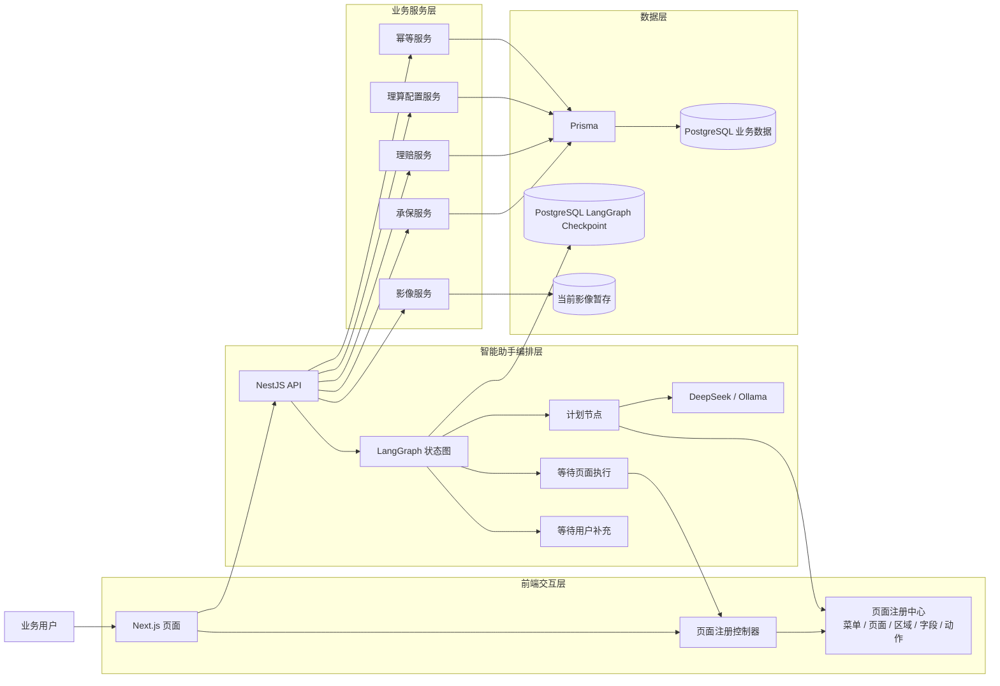
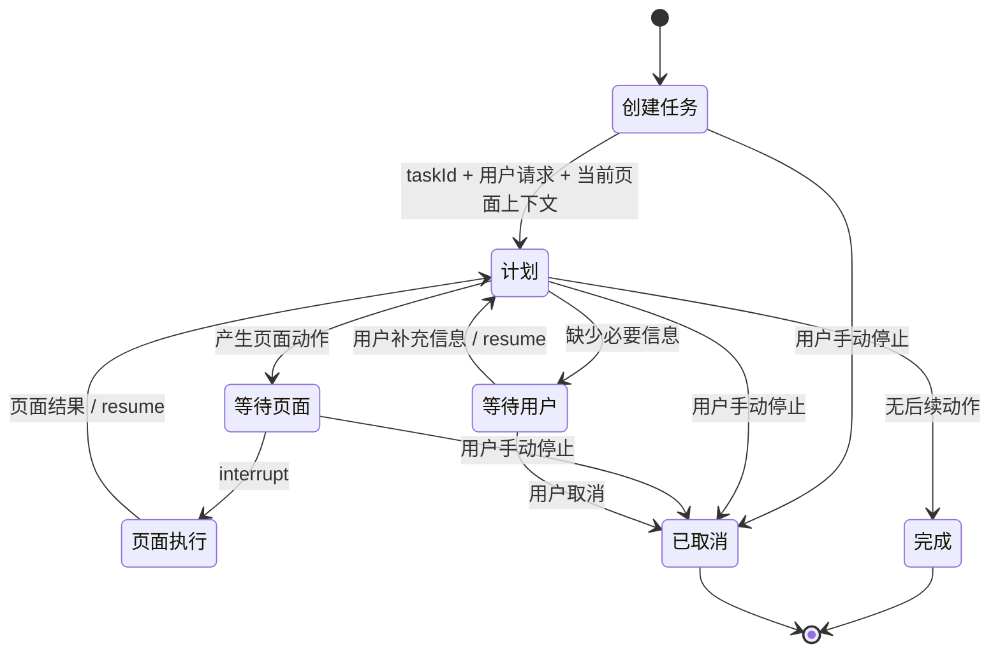
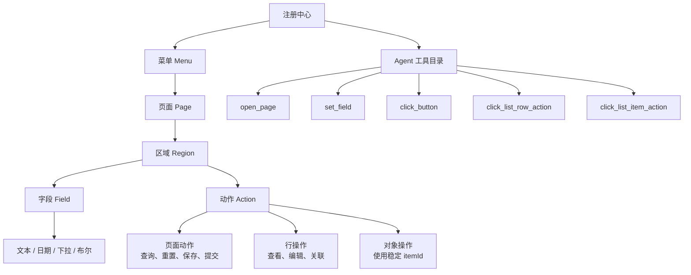
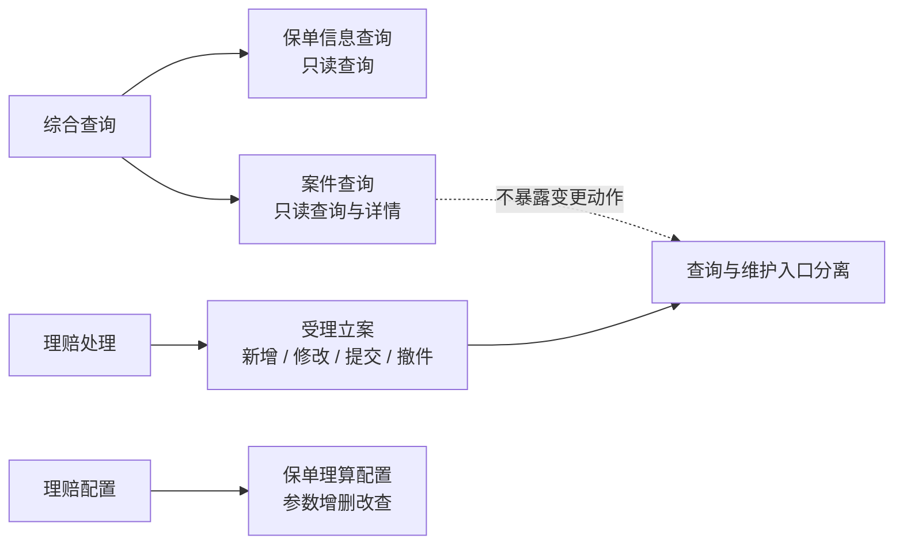
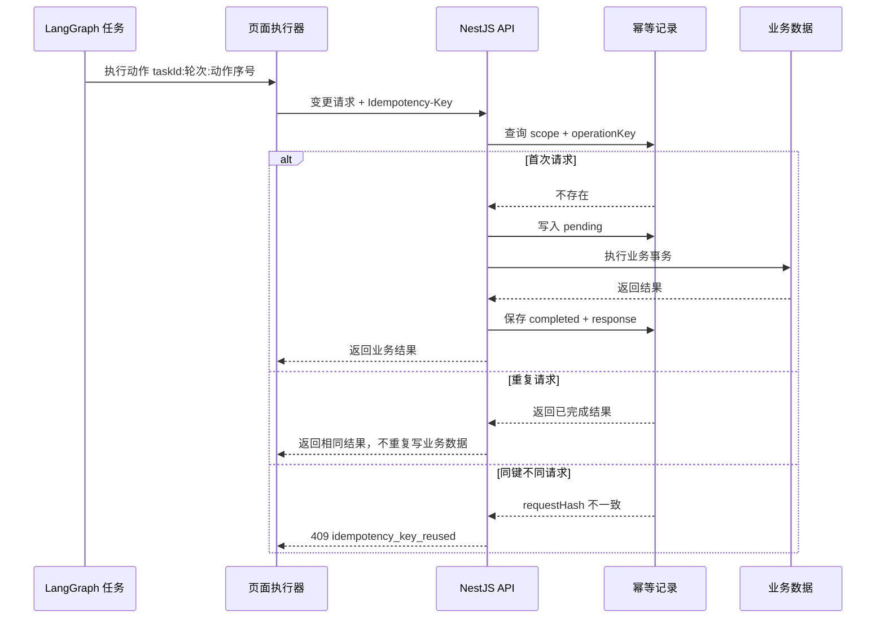

# 系统流程与元素图解

## 1. 系统总体架构

### 讲解

- Next.js 只负责页面、交互状态和执行注册动作，不直接承载业务 API。
- NestJS 是所有业务查询、保存、提交、撤件和参数维护的服务边界。
- LangGraph 只负责任务状态和流程编排；实际页面操作仍由注册控制器确定性执行。
- PostgreSQL 同时保存业务数据、幂等记录和 LangGraph 检查点，因此 API 重启后任务仍能继续。

## 2. 智能助手完整流程

每次进入“等待用户”或“等待页面”都会产生 PostgreSQL 检查点。恢复请求只需要原来的 `taskId`，不依赖原 NestJS 进程内存。

## 3. 页面可操作元素模型

### 元素职责

| 元素 | 作用 | Agent 使用方式 |
| --- | --- | --- |
| 菜单 | 组织业务入口 | 查询菜单下有哪些页面 |
| 页面 | 定义独立业务能力 | 使用 `pageId` 打开 |
| 区域 | 组织查询区、列表区、编辑区 | 帮助模型理解字段和动作上下文 |
| 字段 | 定义可填写值、类型和选项 | 使用 `fieldId` 填写 |
| 页面动作 | 查询、重置、保存、提交、撤件 | 使用 `actionId` 执行 |
| 行操作 | 对当前可见列表行操作 | 使用从 1 开始的行号 |
| 对象操作 | 对后台结果中的稳定对象操作 | 使用 `itemId`，不依赖排序 |

## 4. 业务页面与权限

综合查询下的页面只注册查询、重置和查看动作。案件保存、提交、撤件只存在于“理赔处理 → 受理立案”，从注册信息和执行器两层阻止 Agent 越权。

## 5. 变更动作幂等流程

Agent 的操作编号由 `taskId + 页面续跑轮次 + 动作序号` 组成。同一检查点因网络重试或恢复而再次执行时，会命中原结果，而不会重复立案、重复新增事件或重复保存参数。

当前影像上传使用进程内暂存，不缓存为幂等结果；影像删除已支持幂等。影像正文迁入对象存储后，再将上传纳入同一持久化幂等流程。
