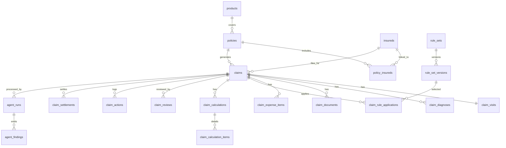

# 健康险理赔领域模型 V1

## 1. 设计目标

当前原型使用 `claims.payload` 和 `rules.payload` 直接存 JSON，优点是启动快，但不适合后续这些场景：

- 按案件状态、医院、诊断、金额做检索
- 分角色分阶段处理案件
- 记录理算版本、审批版本、留痕轨迹
- 给 Agent 提供稳定、可查询的结构化上下文
- 从住院医疗险扩展到门急诊、津贴险、重疾险

所以 V1 的目标是先把核心对象拆出来，形成可以支撑 `受理 -> 理算 -> 审批 -> 结案` 的第一版正式数据模型。

## 2. 领域对象

### 保单域

- `products`
  产品主数据
- `policies`
  保单主数据
- `policy_insureds`
  保单与被保险人的关系

### 客户域

- `insureds`
  被保险人主数据

### 理赔案件域

- `claims`
  案件主表
- `claim_visits`
  本次就诊/住院主记录
- `claim_diagnoses`
  诊断信息
- `claim_documents`
  材料清单
- `claim_expense_items`
  费用明细

### 规则与理算域

- `rule_sets`
  规则集主表
- `rule_set_versions`
  规则版本
- `claim_rule_applications`
  某个案件实际命中的规则版本
- `claim_calculations`
  理算结果主表
- `claim_calculation_items`
  理算明细，例如剔除项、免赔额、赔付基数

### 审批与结案域

- `claim_reviews`
  审批主表
- `claim_actions`
  案件动作流水
- `claim_settlements`
  结案结果

### Agent 辅助域

- `agent_runs`
  每次 Agent 执行记录
- `agent_findings`
  Agent 输出的风险点、摘要、建议

## 3. 主关系

## 4. 关键表职责

### `claims`

案件主表只放案件级核心字段，不再承载整包 JSON。

应承载：

- 案件号
- 保单号
- 被保险人
- 报案时间
- 案件类型
- 当前状态
- 当前处理阶段
- 当前建议动作
- 是否标准件

### `claim_visits`

承载本次就诊或住院的主记录。

- 医院
- 科室
- 入院日期
- 出院日期
- 就诊类型

### `claim_diagnoses`

一案多诊断，因此单独拆表。

- 诊断顺序
- 诊断名称
- 编码体系
- 编码值
- 是否主诊断

### `claim_documents`

一案多材料，一份材料有收件状态、OCR 状态、分类状态。

- 材料类型
- 文件名
- 文件路径
- 收件状态
- OCR 状态
- 抽取状态

### `claim_expense_items`

未来理算 Agent 最依赖的一张明细表。

- 费用项目
- 金额
- 医保内外标识
- 自费标识
- 规则剔除标识
- 剔除原因

### `claim_calculations`

存一次完整理算的“结果快照”。

- 理算版本号
- 总费用
- 医保报销
- 自费金额
- 剔除金额
- 免赔额
- 赔付比例
- 应赔金额
- 建议动作

### `claim_actions`

作为全流程留痕表，比当前原型更正式。

- 动作类型
- 动作阶段
- 操作人
- 操作角色
- 动作说明
- 发生时间

### `agent_runs`

记录某次 Agent 运行，不把 Agent 输出和业务结果混在一起。

- Agent 类型
- 触发来源
- 输入摘要
- 模型名
- 状态
- 执行耗时

### `agent_findings`

记录 Agent 的输出项。

- finding 类型
- 标题
- 内容
- 严重级别
- 结构化 JSON

## 5. 给 Agent 的结构化上下文

未来 Agent 不应该直接读“整包案件 JSON”，而应该从这些表拼上下文：

- 案件主信息：`claims`
- 就诊信息：`claim_visits`
- 诊断信息：`claim_diagnoses`
- 单证情况：`claim_documents`
- 费用明细：`claim_expense_items`
- 历史理算：`claim_calculations`
- 历史动作：`claim_actions`
- 命中规则：`claim_rule_applications`

## 6. 当前原型到正式结构的迁移原则

### 现在的原型表

- `claims(payload JSON)`
- `rules(payload JSON)`
- `claim_actions`

### 迁移思路

1. `claims.payload` 拆到：
   - `claims`
   - `claim_visits`
   - `claim_diagnoses`
   - `claim_documents`
   - `claim_expense_items`
2. `rules.payload` 拆到：
   - `rule_sets`
   - `rule_set_versions`
3. 当前理算结果不直接持久化，需要补：
   - `claim_calculations`
   - `claim_calculation_items`
4. 当前 `claim_actions` 可以保留，但要补：
   - `stage`
   - `actor_name`
   - `actor_role`

## 7. 建议实施顺序

1. 先建正式表
2. 写一次原型数据迁移脚本
3. 仓储层改成读正式表
4. 理算引擎改成基于正式表对象组装输入
5. 最后再重构前端和 Agent
